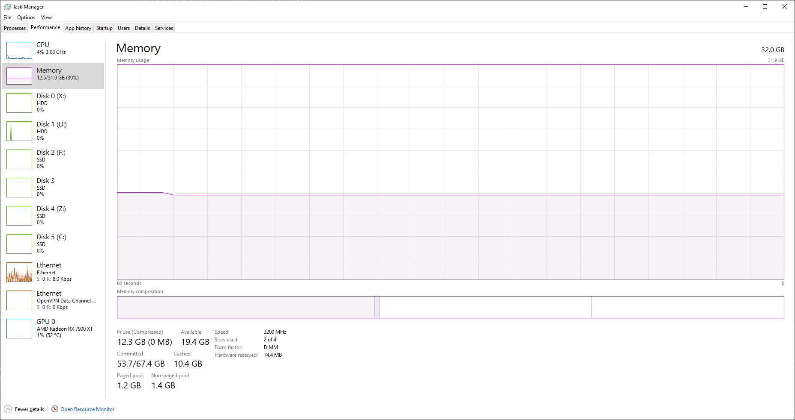
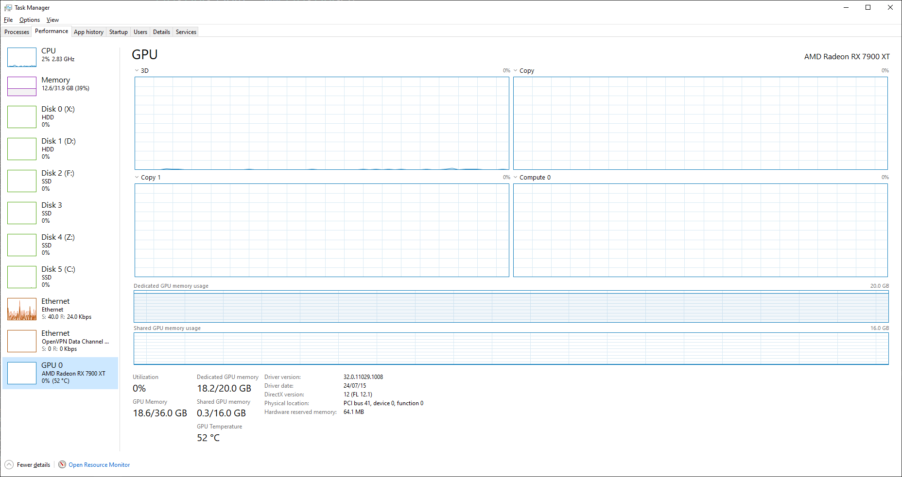
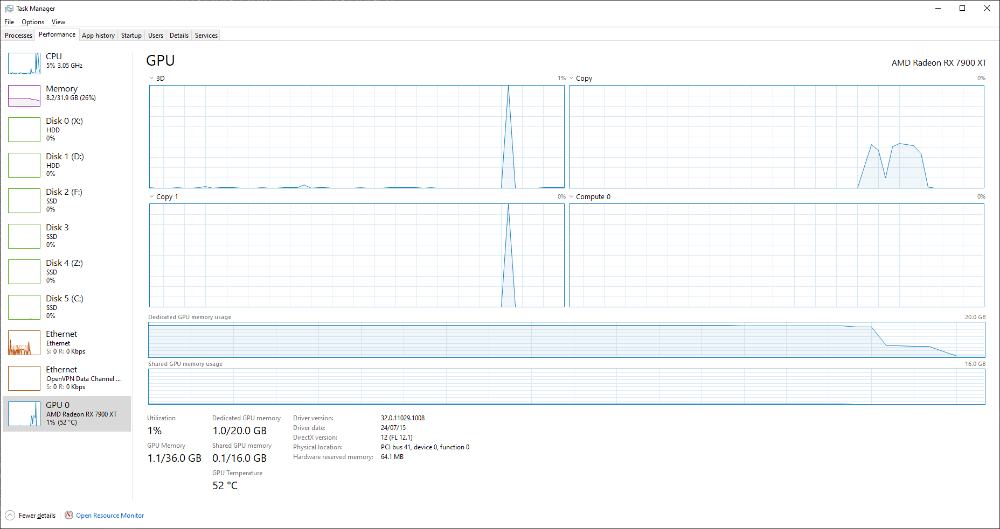

# Mozilla_Firefox_Bugreport
 recollections of a mozilla firefox issue with memory consumption.  
 
 Ram & Page File, and VRam comparison before and after restarting Firefox after leak.  
 
 
 ### Memory
| Before          | After           |
|-----------------|-----------------|
|  |  |

### VRam
| Before          | After           |
|-----------------|-----------------|
|  |  |

 ## Windows Event Viewer
 ### Resource-Exhaustion-Detector
  Windows successfully diagnosed a low virtual memory condition. The following programs consumed the most virtual memory: firefox.exe (4756) consumed 3025575936 bytes, VNyan.exe (26416) consumed 1831944192 bytes, and obs64.exe (3532) consumed 1496326144 bytes.
 
 ### Application Popup
  Application popup: Windows - Out of Virtual Memory : Your system is low on virtual memory. To ensure that Windows runs properly, increase the size of your virtual memory paging file. For more information, see Help. 
 
 ### Application Error (Visual Studio) 
 Faulting application name: devenv.exe, version: 17.11.35208.52, time stamp: 0x66b4ebf1  
 Faulting module name: KERNELBASE.dll, version: 10.0.19041.5131, time stamp: 0x011921da  
 Exception code: 0xe0434352  
 Faulting process id: 0x2c08  

 ## Additional non-Event Viewer logs
 ### OBS
		11:00:57.305: [texture-amf-h264: 'advanced_video_stream'] amf_encode_tex: Failed to create texture: 0x8007000E
		11:00:57.305: Error encoding with encoder 'advanced_video_stream'
		11:00:57.305: Video stopped, number of skipped frames due to encoding lag: 5/41975 (0.0%)
		11:00:57.305: [rtmp stream: 'adv_stream'] Encoder error, disconnecting
		11:00:57.305: [rtmp stream: 'adv_stream'] Socket send buffer is 1048576 bytes
		11:00:57.305: socket_thread_windows: Normal exit
		11:00:57.306: Output 'adv_stream': stopping
		
		--- previous log from another crash due to Firefox's memory consumption (24/11/12) ---
		
		09:53:40.916: [texture-amf-h264: 'advanced_video_stream'] amf_encode_tex: QueryOutput failed: AMF_OUT_OF_MEMORY
		09:53:40.916: Error encoding with encoder 'advanced_video_stream'
		09:53:40.916: Video stopped, number of skipped frames due to encoding lag: 137/407195 (0.0%)
		09:53:40.916: [rtmp stream: 'adv_stream'] Encoder error, disconnecting
		
 ### vNyan (Unity based VTubing software)
  Out of Memory error window.